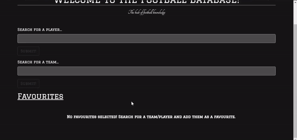
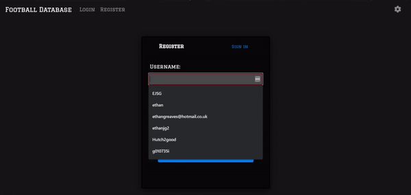
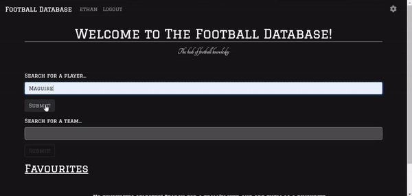

<h1 align="center">⚽ The Football Database ⚽</h1> 

<p align="center">
  
</p>

<hr>
<h4 align="center"><a  href="https://www.google.com">Live Demo</a></h4>
<hr>

## Overview 📖
The Football Database is a web application created using Node.js/Express. Users can search for any football team or player and a fetch request is made to [The Sports DB API](https://www.thesportsdb.com/api.php) to give back information. An authentication system was also created using [Passport.js](http://www.passportjs.org/) which allows users to login and add favourites which appears on the home page.

## Technologies used 👨‍💻

* HTML
* CSS/SCSS
* Bootstrap 4
* JavaScript (ES6)
* Embedded JavaScript (EJS)
* Node.js
* Express
* MongodDB
* Mongoose
* Fetch

## Visuals 🎬
<p float="left">
  Adding favourites:&nbsp;&nbsp;&nbsp;&nbsp;&nbsp;&nbsp;&nbsp;&nbsp;&nbsp;&nbsp;&nbsp;&nbsp;&nbsp;&nbsp;&nbsp;&nbsp;&nbsp;&nbsp;&nbsp;&nbsp;&nbsp;&nbsp;&nbsp;&nbsp;&nbsp;&nbsp;&nbsp;&nbsp;&nbsp;&nbsp;&nbsp;&nbsp;&nbsp;&nbsp;&nbsp;&nbsp;&nbsp;&nbsp;&nbsp;&nbsp;&nbsp;&nbsp;&nbsp;&nbsp;&nbsp;&nbsp;&nbsp;&nbsp;&nbsp;&nbsp;&nbsp;&nbsp;&nbsp;
  Authentication:&nbsp;&nbsp;&nbsp;&nbsp;&nbsp;&nbsp;&nbsp;&nbsp;&nbsp;&nbsp;&nbsp;&nbsp;&nbsp;&nbsp;&nbsp;&nbsp;&nbsp;&nbsp;&nbsp;&nbsp;&nbsp;&nbsp;&nbsp;&nbsp;&nbsp;&nbsp;&nbsp;&nbsp;&nbsp;&nbsp;&nbsp;&nbsp;&nbsp;&nbsp;&nbsp;&nbsp;&nbsp;&nbsp;&nbsp;&nbsp;&nbsp;&nbsp;&nbsp;&nbsp;&nbsp;&nbsp;&nbsp;&nbsp;&nbsp;&nbsp;&nbsp;&nbsp;&nbsp;&nbsp;
  Searching:
</p>
<p float="left">
   &nbsp;&nbsp;
   &nbsp;&nbsp;
  
</p>


## Setup ⚙️

### Installation

Both [Node.js](https://nodejs.org/en/download/) and [MongoDB](https://www.mongodb.com/try/download/community) are required for the application to run so make sure you have these installed. 

*Versions*

* Node.js - v12.18.0 or higher
* MongoDB - v4.4.1 or higher

Clone the repository to your local system then in the terminal at the root folder run: 
```bash
npm install
```
to acquire the node_Modules and dependencies for this project.

### Usage

*If Node.js and MongoDB are installed locally...*

In the terminal go to the drive where MongoDB is installed and run this command
```bash
mongod
```
then naviagte back to the project root folder and run:
```bash
node app.js
```

The Express server should then start on port 3000 and the website can be viewed on your LocalHost.
